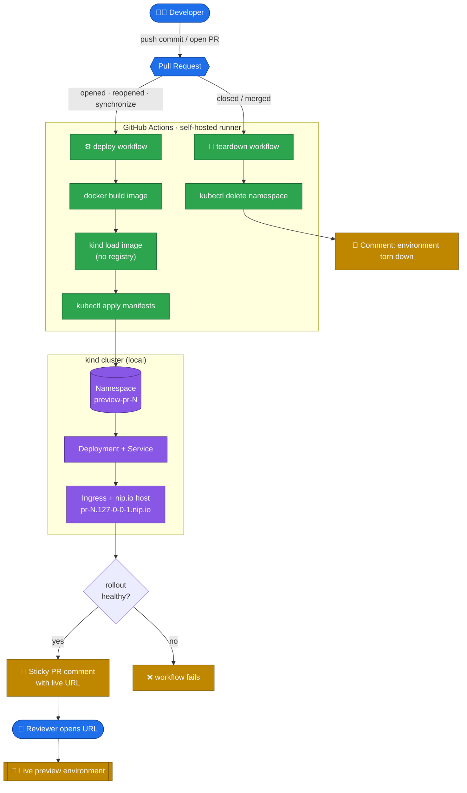

# Ephemeral PR Preview Environments

Open a pull request → a GitHub Action builds your app, deploys it to an **isolated
Kubernetes namespace**, and comments a **live URL** on the PR. Close the PR → it's
torn down automatically. This is the pattern behind Vercel/Netlify previews,
built from scratch on local infrastructure.



## The stack

| Concern | Tool | Notes |
|---|---|---|
| Kubernetes | **kind** (Kubernetes-in-Docker) | runs in local Docker |
| CI | **GitHub Actions** + self-hosted runner | runs the deploy on your own machine |
| Registry | **`kind load docker-image`** | no registry needed |
| DNS | **nip.io** | `pr-7.127-0-0-1.nip.io` → 127.0.0.1, zero setup |
| Ingress | **ingress-nginx** | routes host → service on localhost:80 |
| App | zero-dependency Node server | tiny image, fast builds |

## Prerequisites

```bash
# macOS (Homebrew). colima is a free, headless Docker runtime (no Docker Desktop).
brew install kind kubectl gettext colima docker
colima start --cpu 4 --memory 4   # provisions the Docker VM
```

## Try it locally in 60 seconds (no GitHub needed)

```bash
make cluster-up          # create kind cluster + ingress-nginx (one time)
make deploy PR=1 BRANCH=feature-login
make deploy PR=2 BRANCH=feature-checkout
make list                # see both preview namespaces
```

Open in your browser — each PR is a separate, isolated environment:

- http://pr-1.127-0-0-1.nip.io
- http://pr-2.127-0-0-1.nip.io

Tear one down:

```bash
make teardown PR=1
```

Or run the whole demo in one shot:

```bash
make demo
```

## Wiring it to real GitHub PRs

Hosted GitHub runners can't reach a cluster on your laptop, so use a **free
self-hosted runner**:

1. Push this repo to GitHub.
2. Repo → **Settings → Actions → Runners → New self-hosted runner**. Follow the
   commands GitHub shows; when asked for labels add **`kind-preview`**.
3. Make sure that runner's shell has `docker`, `kind`, `kubectl`, and `envsubst`
   (`brew install gettext` for envsubst), with a kubeconfig for the
   `kind-pr-preview` context. Run `./scripts/setup-runner.sh` to check.
4. Start the runner (`./run.sh`).

Now open a PR: [.github/workflows/preview-deploy.yml](.github/workflows/preview-deploy.yml)
builds, deploys, and posts a sticky comment with the URL. Closing the PR triggers
[.github/workflows/preview-teardown.yml](.github/workflows/preview-teardown.yml).

> **Make URLs clickable for remote reviewers** (optional): run a
> [Cloudflare Tunnel](https://developers.cloudflare.com/cloudflare-one/connections/connect-networks/)
> to expose localhost:80, and swap the `HOST` in
> [scripts/deploy-preview.sh](scripts/deploy-preview.sh) to your tunnel hostname.

## How isolation works

Every PR gets its own namespace `preview-pr-<n>` containing a Deployment, Service,
and Ingress. Resource limits (`250m` CPU / `128Mi` RAM per pod) keep previews from
starving each other. Teardown is just `kubectl delete namespace` — one command
removes everything.

## Repo layout

```
app/                     zero-dependency Node web app
Dockerfile               tiny alpine image
cluster/kind-config.yaml kind cluster with ingress ports mapped to localhost
k8s/preview.template.yaml per-PR Namespace + Deployment + Service + Ingress
scripts/                 setup-cluster, deploy-preview, teardown-preview, setup-runner
.github/workflows/       deploy on PR open/push, teardown on PR close
Makefile                 friendly entrypoints (make help)
```

Run `make help` for all targets.
